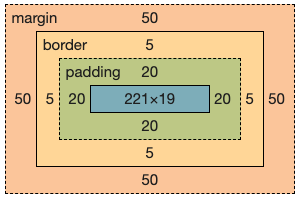

# HTML을 CSS로 꾸며보자 - 파트3(Box Model)

* 이 박스를 Box Model이라고 한다.
* 어디가 margin인지, border인지, padding인지 알아야 한다.

<figure><figcaption><p>위 코드에서 up이라는 Box Model</p></figcaption></figure>

```html
<!DOCTYPE html>
<html lang="en">
<head>
    <meta charset="UTF-8">
    <title>Document</title>
    <link rel="stylesheet" href="style.css">
</head>
<body>
    <div id="up">
        Up
    </div>
    <div id="down">
        Down
    </div>
</body>
</html>
```

```css
#up {
    border-style: solid;
    border-width: 5px;
    margin: 50px;
    padding: 20px;
}

#down {
    border-style: dotted;
    border-width: 5px;
    width: 50%; /* 화면에서의 50% */
}
```


<figure><figcaption><p>위 HTML 코드 결과(CSS3)</p></figcaption></figure>


